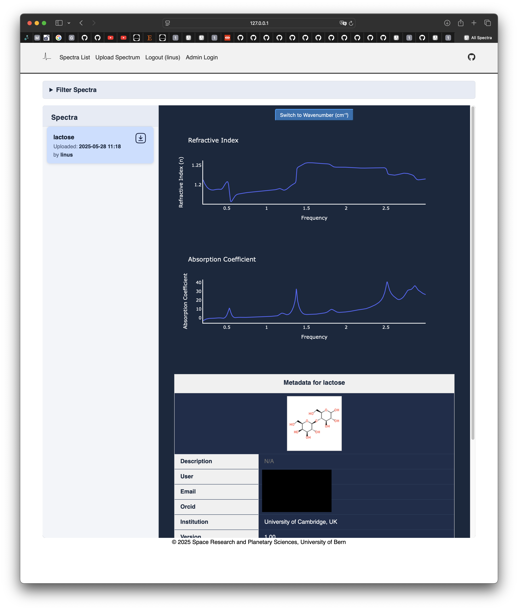

# THz Time-Domain Spectra Database

This is a Django-based web application for managing and serving a database of THz time-domain spectra. The application provides a user-friendly interface for uploading, viewing, and analyzing THz spectra data.

Files can be uploaded in the [dotTHz](https://github.com/dotTHzTAG) format, which is a specialized format for storing THz time-domain spectra.
The file should contain a `Sample` and `Reference` dataset (time-domain) and the corresponding metadata (only the `Sample Thickness (mm)` is essential).
After uploading, the time domain data is automatically converted to refractive index and absorption coefficient using the [thzpy](https://github.com/dotTHzTAG/thzpy) library , which are then stored in the database for easy analysis.

Files can be downloaded in the dotTHz format (they are freshly generated with adapted metadata). 

The application supports features such as user authentication, data visualization, and metadata management. If available, the corresponding chemical structure image will be grabbed from `ChemSpider` and displayed in the details view of the file.



## Setup

Adjust the `backend.env_template` file to your needs and rename it to `backend.env`.
Add certificates in the certs directory if you want to use HTTPS.

## Running in Development Mode
To run the application in development mode, follow these steps:
```shell
python manage.py createsuperuser
```


```shell
python manage.py makemigrations
python manage.py migrate
```

```shell
python manage.py runserver
```

## Running in Docker Container (Production Mode)
```shell
docker-compose exec web python manage.py createsuperuser
```

```shell
docker-compose exec web python manage.py makemigrations
docker-compose exec web python manage.py migrate
```

```shell
docker-compose up --build -d
```
